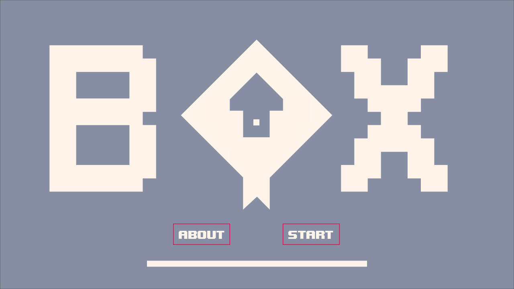

# Boxy

### A simple 2d puzzle platformer game 

This project is a final assignment for the course 'Algoritma dan Struktur Data 1'. The purpose of this project is to demonstrate the understanding of algorithms and data structures concepts learned throughout the course. The project is built using Greenfoot, a IDE specifically designed for creating and testing educational computer games.

## Demo app
This game can be download from [Google Playstore](https://play.google.com/store/apps/details?id=com.kxland.boxy)

## Getting Started
In order to setup and work on this project on your own, you will need to:

1. Download Greenfoot IDE from: https://www.greenfoot.org/

2. Clone this project:
`git clone https://github.com/ekastn/Boxy.git`

3. Once you cloned this project, open the Greenfoot IDE and open the src folder. Then, click the "Run" button to start the game.
